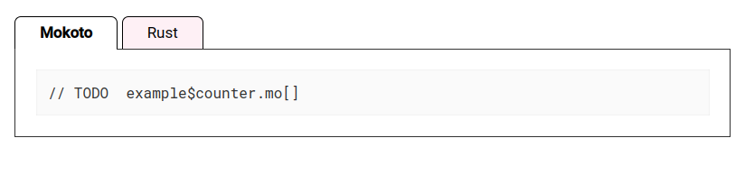

= utilisation d'antora (juillet 2022)

== projet sio-slam

Pour factoriser/harmoniser les ressources pédagogiques éditées en AsciiDoc pour l'enseignement de SIO SLAM deuxième année.

Aller sur https://antora.org/ pour installer en local les outils nécessaires.

cloner le projet

Le play book antora, se lance via la cmd (à la racine du projet) :

`antora antora-playbook.yml`

puis aller voir dans `docs/` afin d'ouvrir `index.html` avec le navigateur.

L'idée est d'inscrire le programme de la semaine (cours+tp ou projet + évaluation etc.) dans le fichier `sio-slam-index/modules/ROOT/page/annee-2022-2023.adoc`

Pour appliquer les changements opérés (modification de contenu asciidoc, ajout de fichiers, de modules, etc.), il est nécessaire de relancer la commade `antora antora-playbook.yml`, puis faire un `commit` puis un `push`. Attendre un peu pour la prise en compte par le système qui gère les `github pages`.

Voir le rendu ici : https://ldv-melun.github.io/sio-slam/

=== configuration Antora Plantuml

Le module `asciidoctor-plantuml` est obsolète.

Une solution : utiliser `kroki`

[code]
----
npm i asciidoctor-kroki

# pour créer l'image en local (et non déléguer à kroki le soin de faire le rendu)
npm install unxhr
----

Dans `antora-playbook.yml` :

[code]
----
asciidoc:
  extensions:
   - ./custom-lib/extension
   - asciidoctor-kroki
  attributes:
     kroki-fetch-diagram: true

----

NOTE: Le reste de ce document explique la configuration du template du site, qui est un projet à part entière pour Antora. Il peut être ignoré.

== projet sio-ui

Basé sur le modèle par défaut d'Antora. C'est la partie `UI template` du site.

=== pour tester le modèle-ui :

à la racine du projet : `gulp preview`

puis aller sur `http://localhost:5252/`

Le _preview_ est basé sur un modèle Antora exemple (`CTRL + C` pour arrêter)

===  Pour le déploiement

Consiste à produit un fichier compressé `.zip` contenant les ressources du template.

`gulp bundle`

Génère le `zip` dans le dossier  `build`.

IMPORTANT: La génération se base sur la dernière version du projet. Faire un `git commit` préalablement (puis un `push` sur la bonne branche)

Dans le `playbook` de sio-slam

[source, yml]
----
  bundle:
#    url: https://gitlab.com/antora/antora-ui-default/-/jobs/artifacts/master/raw/build/ui-bundle.zip?job=bundle-stable
    url: https://github.com/ldv-melun/sio-ui/blob/master/build/ui-bundle.zip?raw=true&v=1
#    url: ./../sio-ui/build/ui-bundle.zip
    snapshot: true
----

TIP: Ne prend pas en compte les changements de `vars.css` si url de github est appliquée (après push)... ??? +
corriger : changer la forme de l'url, par exemple en ajoutant un parametre : &v=1  ceci invalide le cache éventuel +
=> Voir s'il n'existe pas une autre méthode

== Extensions

On peut ajouter des extensions à Antora

J'ai voulu ajouter un système de `tabs` pour la vue `HTML`.  Un projet sur ce thème par David Jencks :
https://gitlab.com/djencks/asciidoctor-tabset-block

https://gitter.im/antora/users?at=5ed806935c9dcd57a10f71cf

Lisa Gunn @lsgunnlsgunn juin 03 2020 23:33

@eskwayrd , I know this is probably user error, but what I'm getting for the tabset output isn't quite what I expect yet.

    I've added the behavior.js as 07-tabset.js to the js folder in my UI src,
    I've copied the styles.css styles into the doc.css file in my UI src.
    I've added ./custom-lib/extensions.js to my playbook file.
    I've added the tab section with include files to my test document:

Ce que j'ai fait :
----
 cp antora-asciidoctor-extensions/tabs-block/behavior.js p4guitar-ui/src/js/07-tabset.js
 cat antora-asciidoctor-extensions/tabs-block/styles.css >> p4guitar-ui/src/css/doc.css
 mkdir custom-l
 cp ../antora-asciidoctor-extensions/tabs-block/extension.js custom-lib/ib
----

dans playbook de sio-slam :

----
asciidoc:
extensions:
- ./custom-lib/extensions
----

Exemple :

[code, antora]
----
[tabs]
====
Motoko::
+
// TODO  example$counter.mo[]

Rust::
+
 // TODO example$counter.rs[]

====
----

`doc.css` update

[source,css]
----
.tabs li {
  [...]
  font-weight: bold;
  height: 2rem;
  background-color: white;
  color: black;
}

.tabset.is-loading .tabs li:not(:first-child),
.tabset:not(.is-loading) .tabs li:not(.is-active) {
  background-color: lavenderblush;
  color: black;
  font-weight: normal;
}
----

Exemple de rendu (copie écran) :

